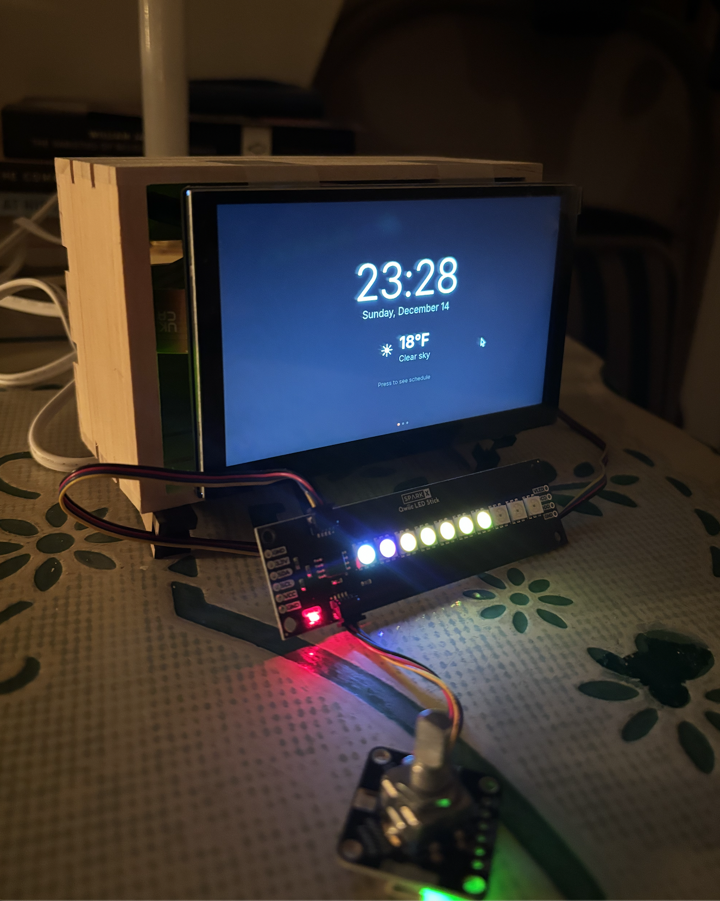
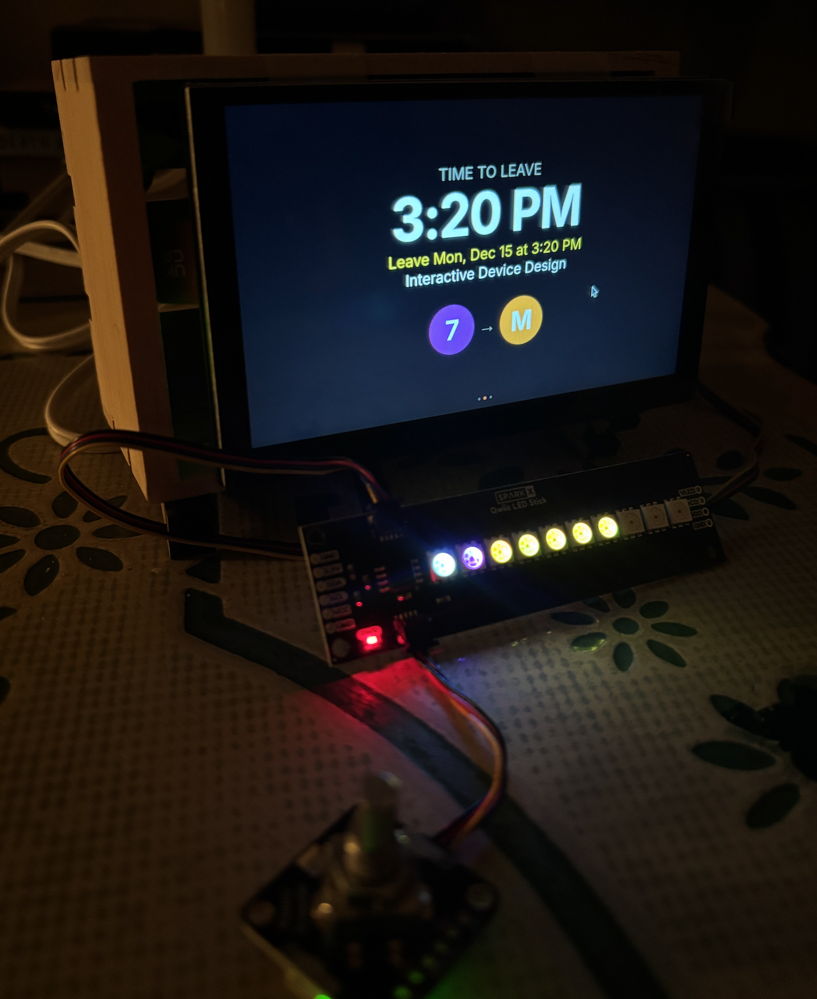
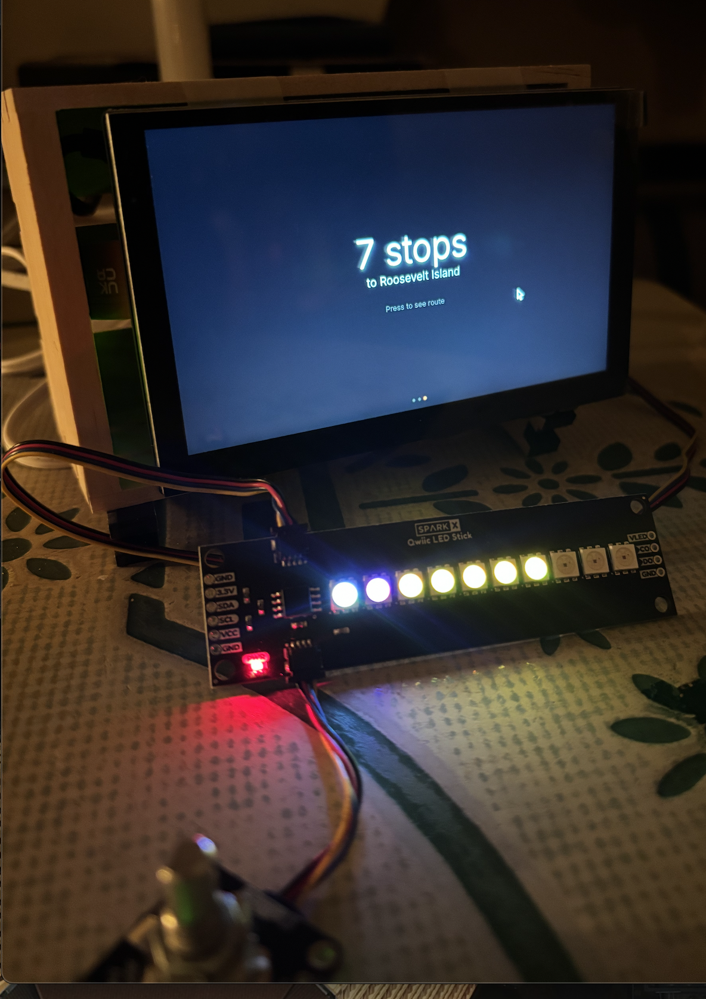
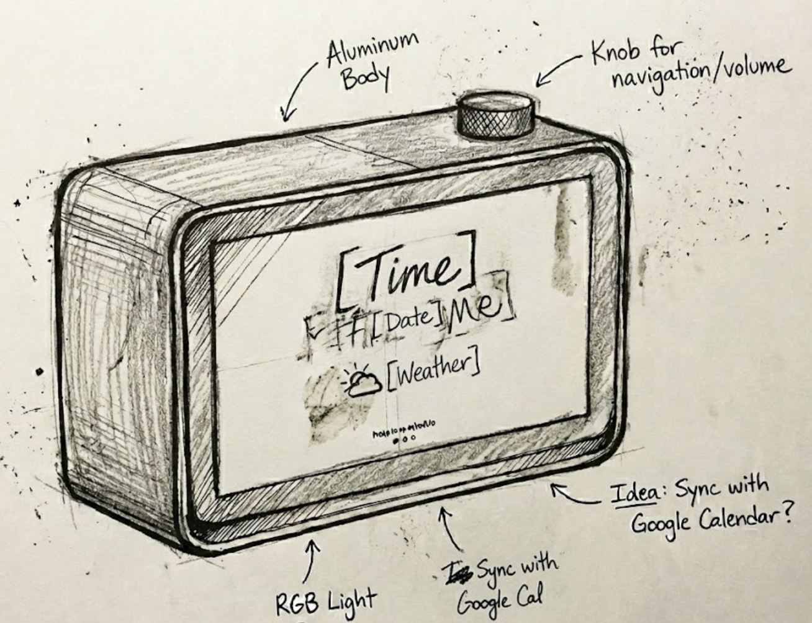

# Final Project - RailReady

Group: Karl Muller (km2262), Om Kamath (ok97)


### Project plan

> A subway tracker that syncs with your class schedule to suggest the best time to leave and the train to choose.

| Milestone | Date | Notes |
| :--- | :--- | :--- |
| **Fetching MTA data** | 11/17 | Selecting the best API for bringing data. |
| **Fetching Calender Data** | 11/21 | Converting `.ics` files to something that is readable. Potential use of LLMs here. |
| **Connect display and wiring everything up** | 11/23 | Creating an Enclosure. Performing user testing. First prototype. |
| **Functional check-off** | 12/1 | Changes Based on User Feedback. |
| **Presentation** | 12/8 | Presentation and User Feedback |
| **Final Documentation** | 12/15 | Full Detailed Write up and Documentation of Project |

### Original Planned Components and Flow
#### Additional Components:
* A dot matrix / LCD Display

#### System Architecture Flow:
1.  **Button/Hotkey**
    * *Context:* or scheduled trigger
    * *Flows to:* Planner Fetch
2.  **Planner Fetch**
    * *Context:* ICS/Google; buffer=60m
    * *Input:* Calendar Data
    * *Flows to:* Transit Compute
3.  **Transit Compute**
    * *Context:* GTFS + GTFS-RT
    * *Input:* Transit Feeds
    * *Flows to:* Leave-Time
4.  **Leave-Time**
    * *Context:* reliability-aware
    * *Flows to:* TTS Output
5.  **TTS Output**
    * *Context:* Speaker: 'Leave in 8 min'


#### Feedback and Project Evolution:
After the functional check off and user feedback, we rethought some of the original design, component, and flow from above. Originally, we were just using the touch screen, with one limited screen where everything was squished together such that text took up a lot of the screen and it wasn't very clear how much this device could help. Taking that feedback is what allowed us to evolve our design in the multiscreen, summary vs detailed, views where you simply moved around with only having to scroll and click with the added rotary encoder component, with everything presented to you clearly and with legible font, without overwhelming you with information. We were able to produce a much better final product after this point to present by 12/8.
The documentation in the following sections will show all the details of this enhanced final product.

#### Fallback Plan:
If enhancing the final product utilizing the help of Gemini 3 to streamline route planning had not worked out, the original plan of directly using and parsing the GTFS data from the MTA API was what we would've continued to use.

## Product: RailReady

### Final Functioning Details

**RailReady** is a Raspberry Pi-powered interactive device that syncs with Google Calendar to help NYC subway commuters catch their trains on time. The device features a rotary encoder navigation interface and a multi-screen dashboard display.

#### Demo Video
Watch the full demonstration of RailReady in action:
[RailReady Demo Video](https://drive.google.com/file/d/1BOdsJX5ugSePaEptHgJ0PKAaXFxyf3lU/view?usp=sharing)

#### Device Screenshots

**Main Screen 1: Clock & Weather Dashboard** <br>
 <br><br>

**Main Screen 2: Transit Status** <br>
 <br><br>

**Main Screen 3: Route Details** <br>
 <br><br>

#### Key Features
- **Google Calendar Integration**: Automatically fetches upcoming events with location data
- **AI Powered Routing**: Gemini API analyzes real time transit data and provides optimal subway routes with departure times, stops, and transfers
- **Rotary Encoder Navigation**: Intuitive scroll and click interface for browsing screens and content
  - **Scroll**: Navigate between the 3 main screens
  - **Click**: Enter detail view for the current screen
  - **Scroll in detail view**: Browse through items (calendar events on Screen 1, individual stops on Screen 3)
  - **Click in detail view**: Return to summary view
- **LED Status Indicators**: Real time visual feedback via SparkX Qwiic LED Stick (10 LEDs)
- **Multi Screen Dashboard**: Three screens, each with summary and detail views:
  - **Screen 1 - Time & Weather**
    - Summary: Large clock display with current date and weather
    - Detail: Upcoming calendar events list with sign in/sign out functionality
  - **Screen 2 - Transit Status**
    - Summary: Time to leave countdown and subway line badge with transfer if provided
  - **Screen 3 - Route**
    - Summary: Total stop count and destination
    - Detail: Individual stop viewer where you can scroll through each subway stop with line information and transfer indicators
- **Live Weather Data**: Integration with Open Meteo API for current conditions
- **Reliability Aware Planning**: Accounts for walking time from your location (current default set to Grand Central Terminal) and provides buffer to ensure on time arrival

### Design Process & Motivation
We wanted to create something similar to products by Divoom (https://divoom.com/) and did not want to the interaction to rely on the touch screen since the screen real-estate was really small.

We decided to integrate a rotary encoder to it and make the navigation based on scroll-and-click functionality.

Our first prototype sketch was something like this:


We then generated a 3D render of it using Gemini Nano Banana Pro.


<br>

### Technical Details (Archive of all code, design patterns, etc.)

#### System Architecture

RailReady consists of a Flask backend server running on a Raspberry Pi, serving an interactive web based dashboard and managing hardware peripherals (LED stick and rotary encoder).

```
┌─────────────────────────────────────────────────────────────────┐
│                         User Interaction                        │
│                                                                 │
│  Rotary Encoder ──> Flask Server ──> Web Dashboard (Browser)    │
│       ↓                   ↓                                     │
│  LED Stick         Google Calendar API                          │
│                    Gemini API (Routing)                         │
│                    Open-Meteo API (Weather)                     │
└─────────────────────────────────────────────────────────────────┘
```

#### File Structure

**Backend (Python)**
- `server.py` - Main Flask application handling:
  - API endpoints for calendar, weather, routing, and LED control
    - Gemini API calls use GCP api key to talk through Gemini 3 model to return a json of data that is used to format the web dashboard with the route
  - Rotary encoder polling thread for hardware input
  - LED animation loop with brightness control and blinking modes
  - Integration with Google Calendar APIs to grab you schedule of current events
  - Route caching system (5 minute TTL) so it doesn't have to make an API call every refresh or event navigation

- `gemini_client.py` - Gemini API wrapper:
  - Loads and populates the prompt template from `prompt.md`
  - Manages API retries with exponential backoff
  - Enables URL context and Google Search tools for real time data
  - Returns JSON formatted routing responses to server

- `gtfs_loader.py` - GTFS data loader (fallback, not actively used):
  - Originally were pursing using the MTA direct API which encodes its data in GTFS. This would parse and allow us to work with that data.
  - Parses static GTFS feed (stops, routes, trips, stop_times)
  - Provides stop sequence lookup by route and station names
  - Included for potential future use but Gemini API provides complete data

**Frontend (HTML/CSS/JS)**
- `index.html` - Dashboard structure with 3 screens:
  - Screen 1: Clock/Weather (summary screen) → Calendar Events (detail screen)
  - Screen 2: Departure Timer (summary screen) 
  - Screen 3: Route Summary (summary screen) → Individual Stop Viewer (detail screen)

- `style.css` - Complete styling including:
  - Responsive layouts for each screen and view mode
  - NYC subway line color coding
  - Smooth transitions between screens
  - Custom scrollbar and typography

- `script.js` - Frontend logic managing:
  - Google OAuth token flow for Calendar access
  - Screen navigation state machine
  - Rotary encoder event polling (long polling to `/api/encoder-event`)
  - Real time countdown timers for time and when to leave
  - LED update commands based on route data
  - Event selection and route planning workflow

**Configuration**
- `prompt.md` - Gemini prompt template with:
  - JSON schema definition for routing responses
  - Instructions for real time MTA data lookup
  - Variables for the event to route: origin/destination/time context

- `requirements.txt` - core python dependencies:
  - Flask, flask-cors (web server)
  - google-genai (Gemini API)
  - Adafruit libraries (I2C hardware: rotary encoder, LED stick)
  - python-dotenv, requests (utilities)

- `.env.example` - Environment variables template:
  ```
  GEMINI_API_KEY=your_gemini_api_key
  GOOGLE_CLIENT_ID=your_google_oauth_client_id
  ```

**Documentation**
- `RASPBERRY_PI_GUIDE.md` - Hardware setup instructions for LED stick wiring and I2C configuration

#### Hardware Components

1. **Raspberry Pi** (any model with I2C support, we used a Raspberry Pi 5, did not test with other versions)
2. **Display** this can be any display, we used the [ELECROW 5 Inch Touchscreen Monitor](https://www.amazon.com/dp/B0F9DFRF25?ref=ppx_yo2ov_dt_b_fed_asin_title) and connected the pi via a [DSI Display Cable, 22in to 15in, 200mm length](https://www.amazon.com/dp/B0D12N6TLW?ref=ppx_yo2ov_dt_b_fed_asin_title) to either CAM/DISP port
3. **Adafruit STEMMA QT Rotary Encoder** (I2C address: 0x36)
   - Incremental encoder for scrolling
   - Built-in button for click events
4. **SparkX Qwiic LED Stick** (I2C address: 0x23)
   - 10 APA102 LEDs via I2C
   - Displays route progress and status
5. **Qwiic/STEMMA cables** for I2C connections

#### Software Setup Instructions

**1. Raspberry Pi Configuration**
```bash
# Enable I2C interface
sudo raspi-config
# Navigate to: Interface Options → I2C → Enable

# Install system dependencies
sudo apt-get update
sudo apt-get install python3-pip i2c-tools git

# Verify I2C devices are detected
i2cdetect -y 1
# Should show devices at 0x23 (LED) and 0x36 (encoder)
```

**2. Project Setup**
```bash
# Clone repository and navigate to project
cd Interactive-Lab-Hub/FinalProject

# Create virtual environment
python3 -m venv venv
source venv/bin/activate

# Install Python dependencies
pip install -r requirements.txt

# Configure environment variables
cp .env.example .env
vi .env  # Add your API keys
```

**3. API Configuration**

- **Gemini API**: Get API key from [Google AI Studio](https://aistudio.google.com/)
- **Google OAuth**: Create OAuth 2.0 Client ID in [Google Cloud Console](https://console.cloud.google.com/)
  - Enable Google Calendar API
  - Add authorized JavaScript origins (e.g., `http://localhost:5000`)
  - Scope: `https://www.googleapis.com/auth/calendar.readonly`
  - This requires owning your own domains if you don't want it to always say "Trust this unsafe developer". It also involves actually using that domain via a server the domain is actually pointing to. Just using localhost will still give you the "Unsafe developer" notice from Google. But for personal use this is fine.

**4. Running the Application**
```bash
# Start Flask server
python server.py

# Access dashboard from browser on the Pi or any device on the network
# Local: http://localhost:5000
# Network: http://<raspberry-pi-ip>:5000
```

**5. Automating RailReady** <br>
In order to make it easier to start up, can add this to the bottom of your `.bashrc.`:
```bash
railready() {
  cd CLONED_REPO_ROOT_LOCATION || return
  source venv/bin/activate
  python server.py &
  SERVER_PID=$!
  trap "echo 'Stopping Server...'; kill $SERVER_PID; return" INT

  sleep 1
  chromium-browser \
    --kiosk \
    --disable-virtual-keyboard \
    --disable-touch-drag-drop \
    --noerrdialogs \
    --disable-infobars \
    --check-for-update-interval=31536000 \
    "http://127.0.0.1:5000"

  wait $SERVER_PID
}
```
That way you can open up a fresh terminal, and just type `railready` and the browser will start up with the server running for you. The extra variables are added to the chromium browser were partially as a result of the touchscreen display we used. In that way, given also a small 5in screen, we only wanted interaction via the rotary encoder. So we made chromium go completely fullscreen and disable the touch alongside the virtual keyboard.

#### Key Design Patterns

**1. Long Polling for Hardware Events**
- Frontend polls `/api/encoder-event` with 30 second timeout
- Server blocks until rotary encoder emits 'cw', 'ccw', or 'click'
- Enables responsive hardware interaction without Websockets

**2. State Machine Navigation**
- Three main screens with summary/detail view states
- Encoder scroll events cycle through screens
- Click events toggle between summary ↔ detail views
- Maintains current screen and view mode in JavaScript state

**3. LED Animation Loop**
- Background thread continuously updates LED stick at 10Hz
- Supports 'static' and 'blink' modes per LED
- Blink mode uses sine wave for smooth breathing effect
- I2C retry logic handles transient hardware errors

**4. Route Caching**
- Cache key combines event ID, destination, and start time
- 5 minute TTL prevents redundant Gemini API calls
- Forced refresh available via `?force=1` query parameter

**5. Modular API Client Classes**
- `GeminiPlanner`: Encapsulates prompt template loading and API calls
- `GTFSData`: Lazy-loads GTFS files only when accessed
- Dependency injection via environment variables

#### Recreating the Project

To recreate RailReady from scratch:

1. **Assemble hardware**: Connect rotary encoder and LED stick to Raspberry Pi via I2C (see `RASPBERRY_PI_GUIDE.md`)
2. **Install software**: Follow setup instructions above
3. **Configure APIs**: Obtain and set Gemini API key and Google OAuth credentials in `.env`
4. **Deploy files**: All code files are included in this directory
5. **Test components**:
   - Verify encoder: Watch console logs for rotation/click events
   - Verify LEDs: POST to `/update-leds` endpoint
   - Verify calendar: Sign in via dashboard and fetch events
6. **Customize**:
   - Modify `DEFAULT_ORIGIN` in `server.py` for different starting locations
   - Adjust `prompt.md` for different routing preferences
   - Change LED brightness via `BRIGHTNESS_PERCENT` constant

### Interaction with RailReady

Video shows someone using RailReady to coordinate transit plans, showing how the device helps determine when and how to get to an event using NYC subway lines. <br>
[Interaction Video - Planning a trip together](https://drive.google.com/file/d/1XxXs4DTlha7_Q37TPRrgLYWmgc_e8_Lg/view?usp=sharing) (had to darken to see the screen/LEDs better on camera)
