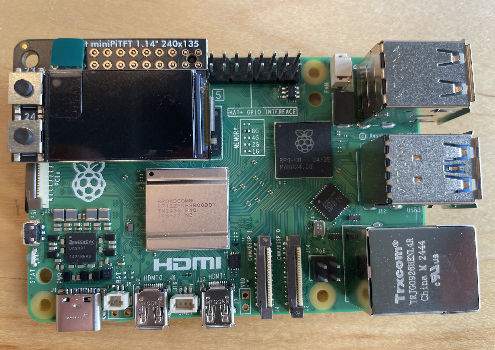
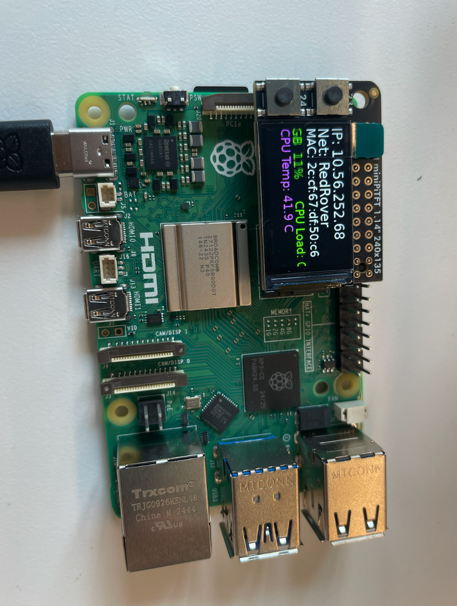
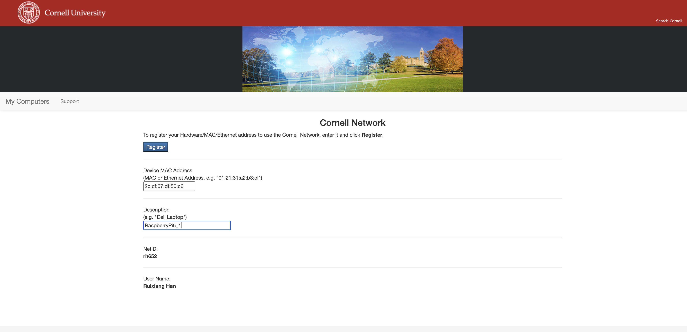

# Prep your Pi


### To prepare your Pi, you will need:

- Raspberry Pi 5
- Raspberry Pi 5 Power Supply
- SD card + Reader
- [Adafruit MiniPiTFT](https://www.adafruit.com/product/4393)


### Burn your Pi image to your SD card
#### On your computer 
- Download the [Raspberry Pi Imager](https://www.raspberrypi.org/software/)
- Download our copy of Raspbian at [this cornell canvas link](https://canvas.cornell.edu/courses/80789/discussion_topics/936162).
Download and use the ``rpi5-2025-09-08.img.gz`` file directly in the Raspberry Pi Imager (do not unzip).

- If using windows: [Windows 11 SSH Client](https://docs.microsoft.com/en-us/windows/terminal/tutorials/ssh), [PuTTY](https://www.putty.org/) or [VS Code SSH](https://code.visualstudio.com/learn/develop-cloud/ssh-lab-machines). 

### Setting up your OS for the Pi
1. Plug the SD card into your computer using the card reader

2. Go download and install the [Raspberry Pi Imager](https://www.raspberrypi.org/software/) on your laptop, download the the customed image file we made for the class. Open the Raspberry Pi Imager and choose the downloaded image file from "Choose OS" and the SD card from "Choose SD card".


3. Click the gear icon on the bottom right to open Advanced Settings. In here, you need to make two changes:
- change the "hostname" to something unique
- ~set the password for user "pi" to something unique to you that you can remember~ Albert says, change the password after you ssh in.
- do not change any of the other settings (username pi and network should stay as they are)

4. Eject or unmount the microSD card reader, and then remove the SD card from the reader and reinsert it into SD card slot on the Pi: it is located on the bottom (silver rectangle on the right).


5. Take and connect the Adafruit MiniPiTFT to your pi with the configuration shown below, the MiniPiTFT should be on the top left corner of your Pi.



6. Boot the Pi by connecting it to a power source with USB-C connector.

### Setting up your Pi to run in headless mode

#### Connecting to your Pi remotely

Unlike your laptop, the Pi doesn't come with its own keyboard or mouse. While you could plug in a monitor, keyboard, and mouse we will be connecting to your Pi over [SSH](https://en.wikipedia.org/wiki/Secure_Shell). You can do this in [Mac Terminal](https://blog.teamtreehouse.com/introduction-to-the-mac-os-x-command-line) or [Windows 10 SSH Client](https://docs.microsoft.com/en-us/windows/terminal/tutorials/ssh). 

*Note: This set up assumes you boot your raspberry pi the first time when on campus or in The House. If you have a screen, mouse and keyboard you can edit the /etc/wpa_supplicant/wpa_supplicant.conf on the pi to make it connect to your home network already now.*


1. When you boot up your Pi, the MiniPiTFT should have the following information shown:
	
	````
	IP: xxx.xxx.xxx.xxx
	NET: [YourWifiNetwork]
	MAC: xx:xx:xx:xx:xx:xx
	````

	The IP address is what you will need to SSH your Pi later through the same network. The media access control address (MAC address) is a unique identifier assigned to a network interface controller, you will need it later for registering the device if you are using Cornell network (e.g. RedRover). The NET shows which WiFi network your Pi is connected to.
	
	For MAC address: If you are planning to use Cornell network (e.g. RedRover and eduroam), you will have to register the device (your Pi) to the Cornell System to get it online. Please follow the instructions [here](https://it.cornell.edu/wifi/register-device-doesnt-have-browser) from Cornell. Register using the MAC address from your Pi's screen. If you are using the House network, you will need to register the device (your Pi) through [whitesky](https://myaccount.wscmdu.com/myaccount/devices). You might need to wait for a few minutes for your Pi to actually get online after registering it.






3. Verify your Pi is online. In the terminal of your laptop, type `ping <Your Pi's IP Address shown on the MiniPiTFT>` and press enter. If your Pi is online, you should get similar messages as below (with different IP address):
    	
 	```shell
	PING 10.56.129.178 (10.56.129.178): 56 data bytes
	64 bytes from 10.56.129.178: icmp_seq=0 tt1=62 time=11.911 ms
	64 bytes from
	10.56.129.178: icmp_seq=1 ttl=62 time=8.179 ms
	64 bytes
	from
	10.56.129.178: iсmp_seq=2 ttl=62 time=11.489 ms
	64 bytes
	• from
	10.56.129.178: iсmp_seq=3 ttl=62 time=11.932 ms
	```
	
	You can use `control-C` to interrupt and exit the ping (press the `control` key, and while holding it down, also press the `C` key, then let go of both together--this looks like `^C` in the terminal).

4. Once your Pi is online, you can go ahead and SSH into the Pi. In the terminal of your laptop, type in the command
	
	```
	$ ssh pi@<Your Pi's IP Address shown on the MiniPiTFT>
	```
	
	When you first log in it, the terminal will show you a "fingerprint" and ask you whether you want to continue connecting. Type `yes` and press enter. 
	

	```shell
	The authenticity of host '10.56.129.178 (10.56.129.178) ' can't be established.
	ED25519 key fingerprint is SHA256:uRnRAlBikqynXuZ8vc/kVSR8ohLFawA0nn+3Er7TXm8.
	This key is not known by any other names.
	Are you sure you want to continue connecting (yes/no/[fingerprint])? yes
	```

	
	
	If you set your password in the Advanced Settings during imaging, enter that password. If you didn't, the initial setting of your Pi's password is `student@tech`, type it and press enter. Note: the terminal will not show what you type for security so do not worry about it and just make sure you type the correct password. After that, you should see something similar to this:	
	

	```
	pi@10.56.129.178's password: 
	Linux raspberrypi 6.12.25+rpt-rpi-2712 #1 SMP PREEMPT Debian 1:6.12.25-1+rpt1 (2025-04-30) aarch64
	
	The programs included with the Debian GNU/Linux system are free software;
	the exact distribution terms for each program are described in the
	individual files in /usr/share/doc/*/copyright.
	
	Debian GNU/Linux comes with ABSOLUTELY NO WARRANTY, to the extent
	permitted by applicable law.
	Last login: Wed Sep 10 13:10:52 2025 from 128.84.84.249
	pi@raspberrypi:~ $ 

	```

	
	This means you are signed in and your terminal is now connected directly to the 'terminal' on your Pi, via `ssh`. You can tell this by looking at the user and hostname at the beginning of each line, which should now look like:

	```shell
	pi@raspberry ~ $
	```

### IMPORTANT: Configure Your Home WiFi NOW! 🚨

**Before you continue, take 2 minutes to set up your home WiFi** - this will save you from getting locked out later!

While you're SSH'd into your Pi, configure your home WiFi so you don't lose access when you take your Pi home:

```bash
sudo nmcli connection add type wifi con-name "HomeWiFi" ifname wlan0 ssid "YourNetworkName" wifi-sec.key-mgmt wpa-psk wifi-sec.psk "YourPassword" connection.autoconnect yes
```

**Replace `YourNetworkName` and `YourPassword` with your actual home WiFi details.**

**Why this matters:** If you only have school WiFi configured and take your Pi home, you'll lose SSH access and won't be able to connect remotely to fix it! Having home WiFi pre-configured means your Pi will automatically connect when you get home.

**Verify it worked:**
```bash
nmcli connection show
```
This should list your home network.

**Pro Tip:** Consider also setting up your phone's hotspot as a backup connection:
```bash
sudo nmcli connection add type wifi con-name "PhoneHotspot" ifname wlan0 ssid "YourPhoneHotspotName" wifi-sec.key-mgmt wpa-psk wifi-sec.psk "YourHotspotPassword" connection.autoconnect yes
```

**Do this now while you have SSH access!** Otherwise, you'll need to come back to campus, find a screen, or reconfigure everything using the SD card formatter.

#### WiFi Priority Management - Quick Guide

It's also a good idea to set up your Raspberry Pi to use your phone's hotspot. This way, you can always connect to it, even when you're on the go, allowing you to reconfigure it for new Wi-Fi networks.

You might want to give the hotspot Wi-Fi a higher priority so that it prefers connecting to that network. This way, you can test it even when a different network, like Red Rover, is available:

**Change Priority:**
```bash
# Set priority (higher number = higher priority)
sudo nmcli connection modify "connection-name" connection.autoconnect-priority 10
```

**Check Status:**
```bash
# View all connections with priorities
nmcli -f NAME,AUTOCONNECT,AUTOCONNECT-PRIORITY connection show
```

**Test Switching:** (or just reboot the pi)
```bash
# Force connection to test
sudo nmcli connection up "connection-name"
```


### If you want to change the password of your Pi

Write it down somewhere because we do not know how to recover lost passwords on the Pi. In the terminal on your Pi, type `sudo raspi-config` and press enter, you should be able to see the manual of your Pi:


Choose '1. System Options' and 'S3 Password', they terminal will then ask you to enter your new password. Again, the terminal will not show what you type for security so do not worry about it and just make sure you type the correct new password twice. After you change the password successfully, you will have to use the new password next time you SSH to your Pi.

### Refresh your knowledge of command line interfaces: 

The command line/terminal is a powerful way to interact with your computer without using a Graphical User Interface (GUI). When you SSH onto your Pi, you have a prompt you can enter commands. In your terminal there is a shell, there are many shells but for this class we will use one of the most common **bash**

	```
	pi@raspberrypi:~ $ echo $SHELL
	/bin/bash
	pi@raspberrypi:~ $ 
	```
In the code above we've typed `echo $SHELL`. The `echo` tells it to print something to the screen. You could try typing `echo 'hello'` to see how that works for strings. The `$` at the front of `$SHELL` tells bash we are referring to a variable. In this case it is a variable the OS is using to store the shell program. In a folder `/bin` is a program called bash that we are currently using. The up arrow with show the most recent command.


#### Navigation in the command line

There are many commands you can use in the command line, they can take a variety of options that change how they are used. You can look these up online to learn more. Many commands have a manual page with documentation that you can see directly in the terminal by typing `man [command]`. For example:

	```shell
	pi@raspberrypi:~ $ man echo
	ECHO(1)                           User Commands                          ECHO(1)
	
	NAME
	       echo - display a line of text
	SYNOPSIS
	       echo [SHORT-OPTION]... [STRING]...
	       echo LONG-OPTION
	DESCRIPTION
	       Echo the STRING(s) to standard output.
	       -n     do not output the trailing newline
	       -e     enable interpretation of backslash escapes
	       -E     disable interpretation of backslash escapes (default)
	       --help display this help and exit
	       --version
	Manual page echo(1) line 1 (press h for help or q to quit)
	```

  
These are some useful commands. Read the manual pages for advanced usage.
	
* `pwd` - print working directory, tells us where on the computer we are
* `ls` - list the things in the current directory. 
* `cd` - change directory. This lets you move to another folder on your machine.
* `mkdir` - make directory. You can create directories with this command
*  `cp` - copy a file. You can copy from one place to any other place
*  `mv` - move a file, also used to rename a file
*  `rm` -  delete a file. To delete a folder you need the recursive flag `rm -r [folder]`
*  `cat` - view a file
*  `nano` - this is a text editor (there are many) that will let you edit files in terminal.
 
There is plenty more to learn about using the terminal to navigate a computer but this should give a good start for getting around the raspberry pi.


### Using VNC to see your Pi desktop
Another convenient way to remotely connect to your Pi is using VNC (Virtual Network Computing), it essentially is remote login. The easiest client to use is [VNC Connect](https://www.realvnc.com/en/connect/download/viewer/). Download and install it. Once that's done type the IP address of your Pi in the text-box at the top. 


After that a login window should appear, use your normal logins (originally: Account=pi, Password=raspberry).


You might want to change a few settings to improve the VNC experience such as changing the display resolution.
To change the resolution, run the command sudo raspi-config, navigate to Display Options > VNC Resolution, and choose an option.
See here for more troubleshooting [realvnc.com Pi Setup](https://help.realvnc.com/hc/en-us/articles/360002249917-VNC-Connect-and-Raspberry-Pi). 


At that point the normal RPi desktop should appear and you can start and stop programs from here. 

### Setting up WendyTA - Your AI Teaching Assistant

For this course, we have **WendyTA**, an AI Teaching Assistant that can help you with coding, debugging, brainstorming, and learning. WendyTA is automatically activated through GitHub Copilot Chat when working in this repository.

**📖 Learn more about WendyTA**: [WendyTA Documentation](https://github.com/IRL-CT/Interactive-Lab-Hub/tree/Fall2025/WendyTA)

#### Recommended Setup Options:

1. **VS Code Server on your laptop** (Recommended): Use VS Code's Remote SSH extension to connect to your Pi and code directly with WendyTA available.

2. **VNC + VS Code on Pi**: Use VNC to access the Pi desktop and install VS Code there with GitHub Copilot extension.

**Setup Instructions**: [WendyTA Copilot Setup Guide](https://github.com/IRL-CT/Interactive-Lab-Hub/blob/Fall2025/WendyTA/setup/copilot-setup.md)

✨ **Note**: WendyTA works through both SSH/VS Code Server and VNC connections, so choose the method that works best for your setup!


