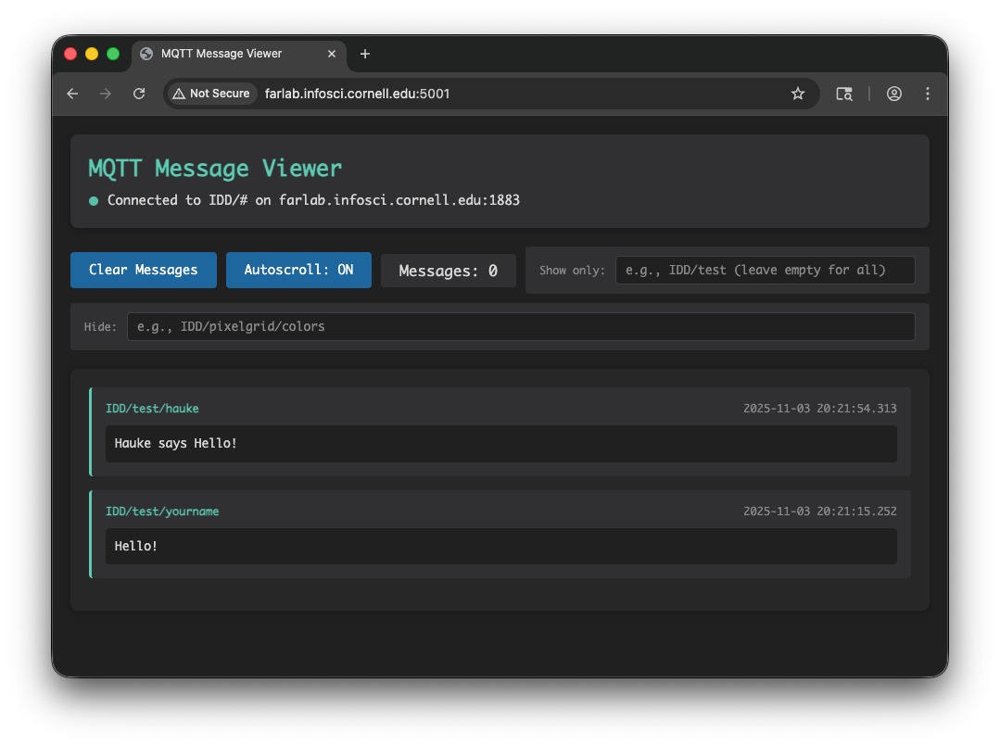
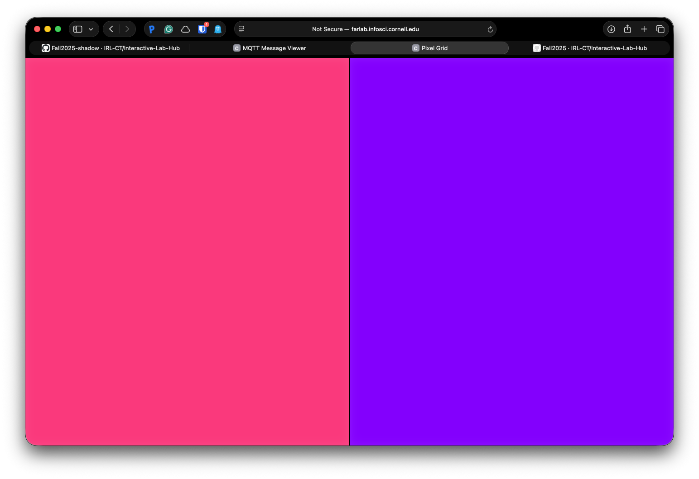

# Distributed Interaction

**NAMES OF COLLABORATORS HERE**

For submission, replace this section with your documentation!

---

## Prep

1. Pull the new changes
2. Read: [The Presence Table](https://dl.acm.org/doi/10.1145/1935701.1935800) ([video](https://vimeo.com/15932020))

## Overview

Build interactive systems where **multiple devices communicate over a network** using MQTT messaging. Work in teams of 3+ with Raspberry Pis.

**Parts:**
- A: Learn MQTT messaging
- B: Try collaborative pixel grid demo  
- C: Build your own distributed system

---

## Part A: MQTT Messaging

MQTT = lightweight messaging for IoT. Publish/subscribe model with central broker.

**Concepts:**
- **Broker**: `farlab.infosci.cornell.edu:1883`
- **Topic**: Like `IDD/bedroom/temperature` (use `#` wildcard)
- **Publish/Subscribe**: Send and receive messages

**Install MQTT tools on your Pi:**
```bash
sudo apt-get update
sudo apt-get install -y mosquitto-clients
```

**Test it:**

**Subscribe to messages (listener):**
```bash
mosquitto_sub -h farlab.infosci.cornell.edu -p 1883 -t 'IDD/#' -u idd -P 'device@theFarm'
```

**Publish a message (sender):**
```bash
mosquitto_pub -h farlab.infosci.cornell.edu -p 1883 -t 'IDD/test/yourname' -m 'Hello!' -u idd -P 'device@theFarm'
```

> **💡 Tips:**
> - Replace `yourname` with your actual name in the topic
> - Use single quotes around the password: `'device@theFarm'`

**🔧 Debug Tool:** View all MQTT messages in real-time at `http://farlab.infosci.cornell.edu:5001`



**💡 Brainstorm 5 ideas for messaging between devices**

---

## Part B: Collaborative Pixel Grid

Each Pi = one pixel, controlled by RGB sensor, displayed in real-time grid.

**Architecture:** `Pi (sensor) → MQTT → Server → Web Browser`

**Setup:**

1. **Server** (one person on laptop):
```bash
cd "Lab 6"  
source .venv/bin/activate
pip install -r requirements-server.txt
python app.py
```

2. **View in browser:**
   - Grid: `http://farlab.infosci.cornell.edu:5000`
   - Controller: `http://farlab.infosci.cornell.edu:5000/controller`

3. **Pi publisher** (everyone on their Pi):
```bash
# First time setup - create virtual environment
cd "Lab 6"
python -m venv .venv
source .venv/bin/activate
pip install -r requirements-pi.txt

# Run the publisher
python pixel_grid_publisher.py
```

Hold colored objects near sensor to change your pixel!



**📸 Include: Screenshot of grid + photo of your Pi setup**

---

## Part C: Make Your Own

**Requirements:**
- 3+ people, 3+ Pis
- Each Pi contributes sensor input via MQTT
- Meaningful or fun interaction

**Ideas:**

**Sensor Fortune Teller**
- Each Pi sends 0-255 from different sensor
- Server generates fortunes from combined values

**Frankenstories**
- Sensor events → story elements (not text!)
- Red = danger, gesture up = climbed, distance <10cm = suddenly

**Distributed Instrument**
- Each Pi = one musical parameter
- Only works together

**Others:** Games, presence display, mood ring

### Deliverables

Replace this README with your documentation:

**1. Project Description**
- What does it do? Why interesting? User experience?

**2. Architecture Diagram**
- Hardware, connections, data flow
- Label input/computation/output

**3. Build Documentation**
- Photos of each Pi + sensors
- MQTT topics used
- Code snippets with explanations

**4. User Testing**
- **Test with 2+ people NOT on your team**
- Photos/video of use
- What did they think before trying?
- What surprised them?
- What would they change?

**5. Reflection**
- What worked well?
- Challenges with distributed interaction?
- How did sensor events work?
- What would you improve?

---

## Code Files

**Server files:**
- `app.py` - Pixel grid server (Flask + WebSocket + MQTT)
- `mqtt_viewer.py` - MQTT message viewer for debugging
- `mqtt_bridge.py` - MQTT → WebSocket bridge
- `requirements-server.txt` - Server dependencies

**Pi files:**
- `pixel_grid_publisher.py` - Example (RGB sensor → MQTT)
- `requirements-pi.txt` - Pi dependencies

**Web interface:**
- `templates/grid.html` - Pixel grid display
- `templates/controller.html` - Color picker
- `templates/mqtt_viewer.html` - Message viewer

---

## Debugging Tools

**MQTT Message Viewer:** `http://farlab.infosci.cornell.edu:5001`
- See all MQTT messages in real-time
- View topics and payloads
- Helpful for debugging your own projects

**Command line:**
```bash
# See all IDD messages
mosquitto_sub -h farlab.infosci.cornell.edu -p 1883 -t "IDD/#" -u idd -P "device@theFarm"
```

---

## Troubleshooting

**MQTT:** Broker `farlab.infosci.cornell.edu:1883`, user `idd`, pass `device@theFarm`

**Sensor:** Check `i2cdetect -y 1`, APDS-9960 at `0x39`

**Grid:** Verify server running, check MQTT in console, test with web controller

**Pi venv:** Make sure to activate: `source .venv/bin/activate`

**Stop Screen service (make your screen available again):**
```bash
# stop the screen service
sudo systemctl stop piscreen.service
```

if you want to restart the screen service
```bash
# start the screen service
sudo systemctl start piscreen.service
```


---

## Submission Checklist

Before submitting:
- [ ] Delete prep/instructions above
- [ ] Add YOUR project documentation
- [ ] Include photos/videos/diagrams  
- [ ] Document user testing with non-team members
- [ ] Add reflection on learnings
- [ ] List team names at top

**Your README = story of what YOU built!**

---

Resources: [MQTT Guide](https://www.hivemq.com/mqtt-essentials/) | [Paho Python](https://www.eclipse.org/paho/index.php?page=clients/python/docs/index.php) | [Flask-SocketIO](https://flask-socketio.readthedocs.io/)
